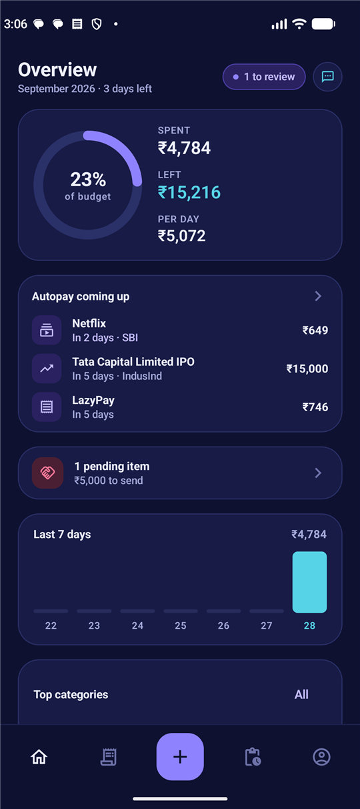
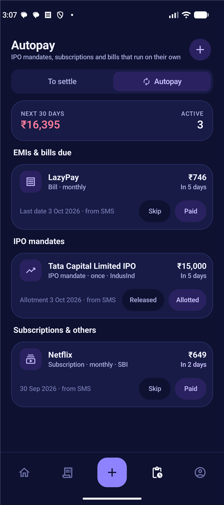
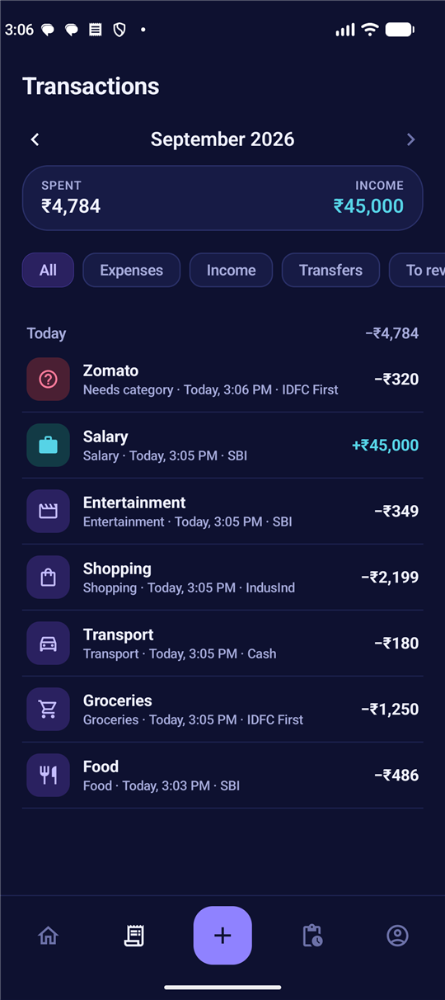
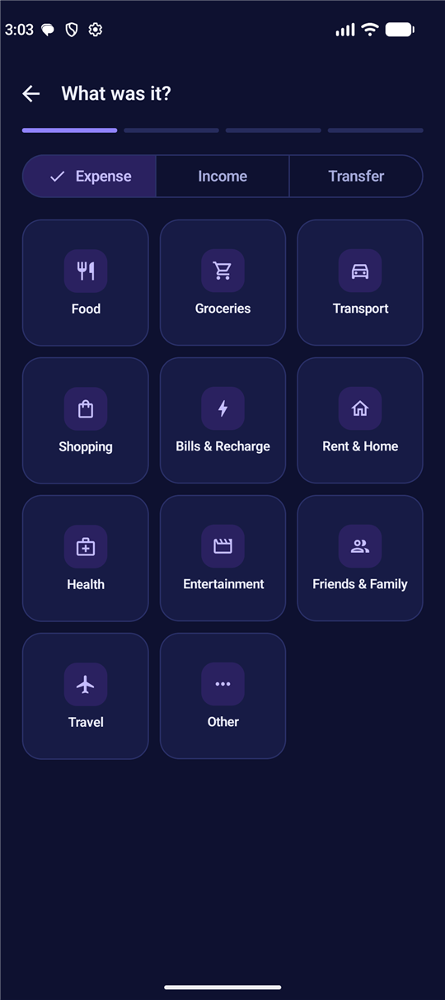
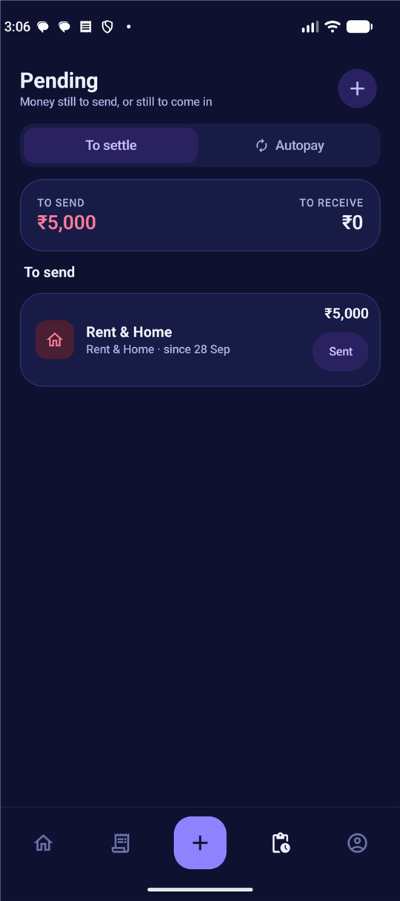
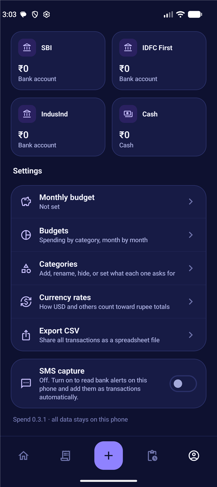

<div align="center">

# Smart Spend Tracker

**A private, offline budget tracker for Android that reads your bank SMS so you don't have to type.**

[](#install)
[](#tech-stack)
[](#tech-stack)
[](#privacy--security)
[](LICENSE)

<br/>

&nbsp;&nbsp;
&nbsp;&nbsp;


</div>

---

## Why this exists

Most expense apps fail for one reason: you stop typing after a week. Smart Spend Tracker
turns the alerts your bank already sends into transactions, keeps the things that are
*about* to happen (EMIs, IPO mandates, subscriptions, money you promised a friend) in
front of you, and never sends a byte off the phone.

- **No account, no server, no internet permission.** Everything lives in a local database.
- **Four taps to add anything by hand**, with categories that ask the right follow-up question.
- **Bank SMS become transactions.** Known payees are filed automatically; unknown ones wait
  for one tap.
- **Autopay awareness.** IPO mandates, EMIs, subscriptions and bills, with reminders before
  the money leaves and one-tap recording when it does.
- **A budget that means something.** Money sent to friends is tracked but does not eat your
  budget.

## Features

### Tracking
| | |
|---|---|
| **Quick add** | Category grid → amount (with currency) → account → note. Categories can ask for a person's name or a description. |
| **Pending** | Switch on *Not paid yet* while adding, and the entry waits under Pending until you tap *Sent*. Money owed to you works the same way. |
| **Accounts** | Bank, card, cash, wallet, crypto or anything else, each with a live balance and its own currency. |
| **Multi-currency** | Amounts in USD, EUR, GBP or AED count toward rupee totals at rates you control. |
| **Budgets** | Monthly budget ring with per-day guidance, spending by category, month by month. |
| **Export** | Share every transaction as CSV. |

### Autopay
| | |
|---|---|
| **Kinds** | IPO mandate, EMI, subscription, bill, insurance, other. |
| **Reminders** | A notification before each due date (daily check around 9 am plus every app open). |
| **Actions** | *Paid* records the expense and moves to the next date. IPOs get *Allotted* / *Released*. |
| **Home card** | Everything due in the next seven days, at the top of the overview. |

### SMS capture
| | |
|---|---|
| **Debits and credits** | Parsed from SBI, IDFC First, IndusInd and generic Indian bank formats; card spends too. |
| **Smart filing** | Payees you have filed once are filed automatically next time (*Remember this*). |
| **Review queue** | Unknown payee or unmatched account → flagged, never guessed. A notification opens the review screen with the original message. |
| **Mandates & dues** | "Mandate created", "EMI due on", "bill of Rs … due by", card statements → Autopay entries with amount and last date. |
| **Auto-match** | When the debit for an autopay arrives, the autopay is marked paid on its own. |
| **Block list** | A lender that keeps repeating a stale reminder? Block the name; its messages are ignored. |
| **Import** | Scan the last 30 days of SMS once on a phone that already has history. |

More detail: [docs/SMS-CAPTURE.md](docs/SMS-CAPTURE.md).

<div align="center">
&nbsp;
&nbsp;

</div>

## Privacy & security

- The app declares **no `INTERNET` permission**. There is no analytics, no crash reporting,
  no sync. Data cannot leave the phone through the app.
- SMS is read only after you switch capture on. Only bank alerts are stored (the original
  text is kept with the transaction so you can check it); every other message is discarded
  as soon as it is parsed.
- Notifications hide amounts and payee names on the lock screen.
- Exports go through a `FileProvider` scoped to the app's own cache folder and only to the
  app you pick in the share sheet.
- The database is the app's private storage, protected by Android's app sandbox. There is
  no encryption at rest beyond that; if your phone is not locked, neither is your data.
- Release builds are signed with a debug key on purpose: this is a personal app that never
  goes to a store. Build it yourself if you want your own signature.

## Install

**Download**: grab `Spend-<version>.apk` from the [Releases](../../releases) page, open it
on the phone and allow installing from that source. Updates install over the previous
version and keep your data.

> **Google Play Protect may block the install.** Because the app asks for SMS permission
> and does not come from the Play Store, Play Protect (especially in India) refuses
> sideloaded installs and shows "App not installed". Either:
> - **Install with a cable**: enable USB debugging on the phone, connect it, and run
>   `adb install Spend-<version>.apk` (or press Run in Android Studio). ADB installs are
>   not blocked.
> - **Or pause Play Protect once**: Play Store → your profile picture → *Play Protect* →
>   settings gear → switch off *Scan apps with Play Protect*, install the APK, switch it
>   back on.
>
> Nothing in the app talks to the internet; the block is only about the SMS permission.

**Build it yourself** (if you would rather not trust a prebuilt APK): open the folder in
Android Studio and press Run, or from a terminal:

```bash
./gradlew :app:testDebugUnitTest :app:assembleRelease
```

Requires Android 8.0 (API 26) or newer. On Android 13+ the app asks for the notification
permission when you first use Autopay or SMS capture.

## Using it

1. **Profile** → add your accounts (last four digits help SMS matching) and set a monthly
   budget.
2. **Plus button** → add anything by hand. Turn on *Not paid yet* to park it under Pending.
3. **Profile → SMS capture** → switch on. Tap *Import recent bank SMS* to backfill.
4. **Home** → tap *to review* whenever the pill appears, pick a category, keep *Remember
   this* on. Each review teaches the app one more payee.
5. **Pending → Autopay** → add mandates and subscriptions by hand, or let the SMS do it.

## Project structure

```
app/src/main/java/dev/spendtracker/
├── data/        Room entities, DAOs, migrations, repository, DataStore settings
├── sms/         SmsParser (pure Kotlin), SmsCapture, SmsReceiver, SmsImporter
├── autopay/     Daily reminder alarm, boot receiver
├── notify/      Notification channels and deep links
├── ui/          Compose screens: home, transactions, edit, pending (+ autopay), profile, settings
└── util/        Money formatting, currencies, dates
app/src/test/    Parser tests with sample bank messages
app/schemas/     Exported Room schemas, one per database version
docs/            SMS capture reference, screenshots
```

## Tech stack

Kotlin · Jetpack Compose (Material 3) · Room · DataStore · Navigation Compose · AlarmManager.
Single module, no third-party libraries beyond AndroidX. Minimum SDK 26, target SDK 36.

## Roadmap

- Sample messages from more banks (send yours: open an issue with the masked text)
- Category budgets in addition to the monthly total
- Backup and restore to a file
- Bundled Sora / Manrope fonts

## Contributing

Issues and pull requests are welcome. If the parser misses an alert from your bank, the
most useful thing you can do is add the message (with account numbers and names masked)
as a test in `app/src/test/java/dev/spendtracker/sms/SmsParserTest.kt`.

## License

[MIT](LICENSE)
